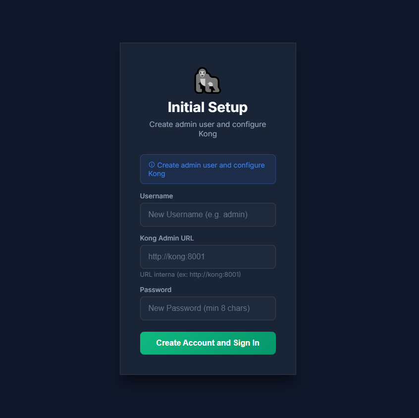
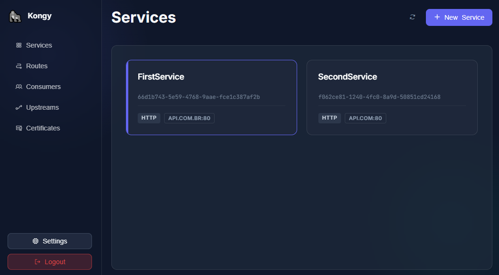
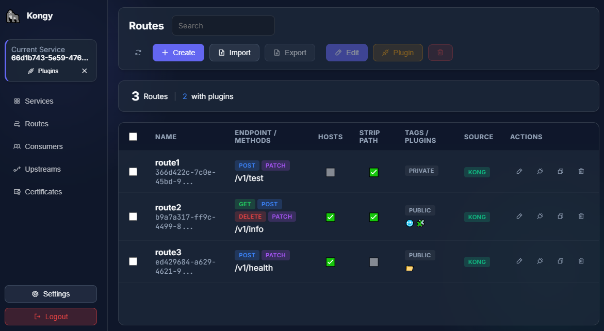
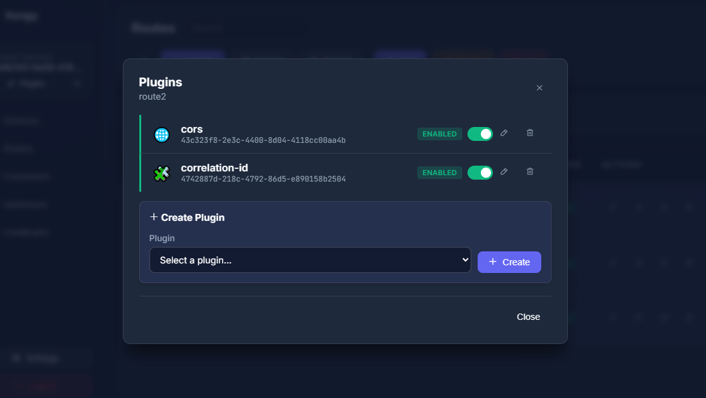

# Kongy 🦍

**Kong Gateway Manager** - Interface visual open source para gerenciamento de rotas, plugins e consumers no Kong Gateway.

[](LICENSE)
[](https://www.python.org/)
[](https://www.typescriptlang.org/)
[](https://vitejs.dev/)
[](https://konghq.com/)

> [!NOTE]
> Read in English: [README.md](README.md)

---

## ✨ Features

- 🔐 **Autenticação própria** - JWT com setup inicial, sem dependência de serviços externos
- 🌍 **Internacionalização** - Suporte a Português (BR) e Inglês (US) com detecção automática
- 🛡️ **Segurança** - Rate limiting, headers de segurança, proteção contra brute-force
- 📦 **Docker Ready** - Pronto para deploy com Docker Compose
- 🧪 **Kong Local** - Ambiente de desenvolvimento com Kong integrado
- 🔌 **Gestão de Plugins** - Aplicar plugins em rotas, serviços e consumers
- 📤 **Import/Export** - Exportar e importar configurações de rotas
- ⚡ **Vite + TypeScript** - Frontend moderno com Hot Module Replacement

---

## 📸 Screenshots

<p align="center">
  
  
  
  
</p>

---

## 🚀 Quick Start

### Com Docker (recomendado)

```bash
# Clone o repositório
git clone https://github.com/seu-usuario/kongy.git
cd kongy

# Copie o arquivo de ambiente
cp .env.example .env

# Inicie todos os serviços (Kong + Kongy)
docker compose up -d

# Acesse http://localhost:8081
```

No primeiro acesso, você será direcionado para criar o usuário administrador.

### Desenvolvimento Local

```bash
# Backend
cd backend
python -m venv venv
source venv/bin/activate
pip install -r requirements.txt
uvicorn app.main:app --reload --port 8000

# Frontend (em outro terminal)
cd frontend
npm install
npm run dev
```

O frontend estará disponível em `http://localhost:8081` com HMR.

---

## 🏗️ Architecture

```
┌─────────────────────────────────────────────────────────────┐
│                     Kongy Container                         │
│  ┌─────────────────────┐    ┌────────────────────────────┐  │
│  │   Frontend (Vite)   │───▶│  Backend (FastAPI)         │  │
│  │   :8081             │    │  :8000                     │  │
│  │   TypeScript/HTML   │    │  - Auth (JWT)              │  │
│  └─────────────────────┘    │  - Kong Proxy              │  │
│                              │  - Rate Limiting           │  │
│                              └──────────┬─────────────────┘  │
│                                         │                    │
└─────────────────────────────────────────┼────────────────────┘
                                          │
                                          ▼
                              ┌─────────────────────┐
                              │   Kong Admin API    │
                              │   :8001 (internal)  │
                              └─────────────────────┘
```

---

## 📁 Project Structure

```
kongy/
├── backend/              # FastAPI backend
│   ├── app/
│   │   ├── auth/         # JWT authentication
│   │   ├── kong/         # Kong Admin API proxy
│   │   ├── storage/      # In-memory storage
│   │   └── middleware/   # Security, rate limiting
│   └── tests/            # Pytest tests
├── frontend/             # Vite + TypeScript frontend
│   ├── src/
│   │   ├── services/     # API, Auth, i18n
│   │   ├── types/        # TypeScript interfaces
│   │   ├── utils/        # Helpers, constants
│   │   ├── app.ts        # Main application
│   │   ├── ui.ts         # UI rendering
│   │   └── store.ts      # State management
│   ├── locales/          # Translations
│   └── vite.config.ts    # Vite configuration
├── docker-compose.yml    # Dev environment (with Kong)
├── docker-compose.prod.yml # Production (external Kong)
└── .env.example          # Environment template
```

---

## ⚙️ Configuration

| Variable | Description | Default |
|----------|-------------|---------|
| `SECRET_KEY` | JWT signing key | `change-me...` |
| `KONG_ADMIN_URL` | Kong Admin API URL | `http://kong:8001` |
| `DEBUG` | Enable debug mode | `false` |
| `JWT_EXPIRE_MINUTES` | Token expiration | `60` |
| `CORS_ORIGINS` | Allowed CORS origins | `["http://localhost:8081"]` |

Veja `.env.example` para todas as opções.

`KONG_ADMIN_URL` e usado como URL inicial do Kong Admin API a cada subida da aplicacao. Se o setup inicial informar outra URL, ela vale apenas em memoria ate o proximo restart.

---

## 🔒 Security

> ⚠️ **Importante**: Dados são armazenados em memória e perdidos ao reiniciar.
> Configure o usuário admin a cada startup.

- JWT Authentication
- Rate Limiting (configurável)
- Proteção contra brute-force
- Security Headers (CSP, X-Frame-Options, etc.)
- Containers não-root

---

## 🧪 Testing

```bash
# Backend
cd backend
pip install -r requirements-dev.txt
pytest --cov=app

# Frontend Build
cd frontend
npm run build
```

---

## 🐳 Docker Production

### Build e Deploy

```bash
# Build de produção
docker compose -f docker-compose.prod.yml build

# Deploy
docker compose -f docker-compose.prod.yml up -d
```

Para publicacao em registry, o Dockerfile do frontend agora gera a imagem de producao com Nginx por padrao:

```bash
docker build \
  --provenance=false \
  --build-arg NPM_REGISTRY=https://nexus.exemplo/repository/npm-group/ \
  -t kongy-frontend:1.0.0 \
  frontend
```

Use `--target dev` apenas quando quiser explicitamente a imagem de desenvolvimento com Vite.

### Kubernetes

Exemplo de deployment disponível em `k8s/` (em breve).

---

## 🤝 Contributing

Contribuições são bem-vindas! Veja [CONTRIBUTING.md](CONTRIBUTING.md).

---

## 📄 License

MIT License - veja [LICENSE](LICENSE).

---

Made with ❤️ by the community
